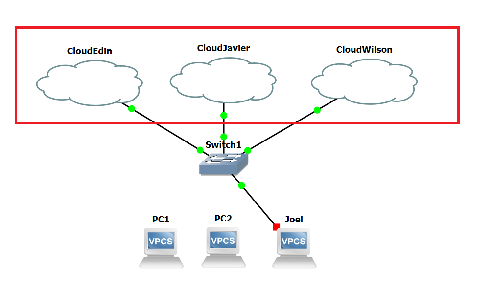
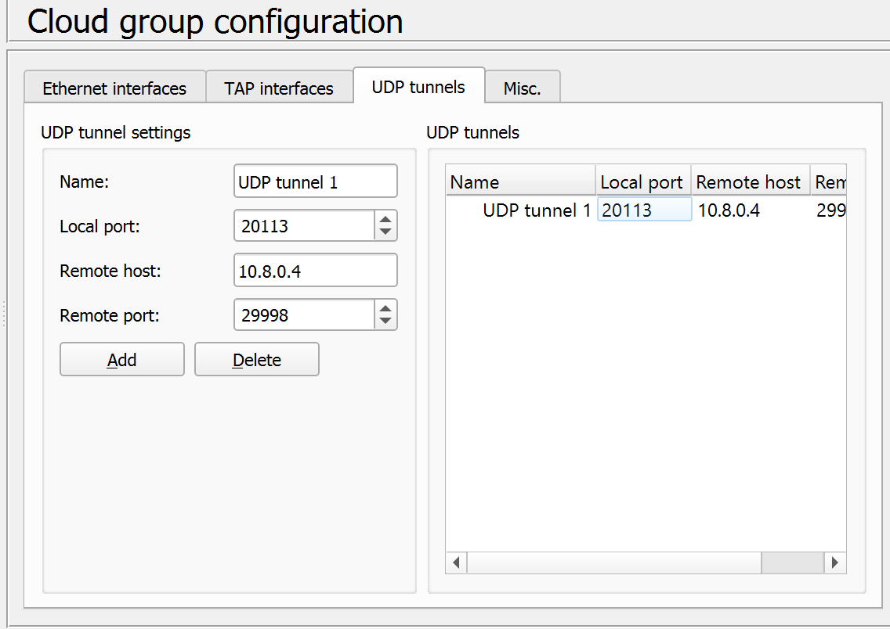

# Configuración de Clouds

En la configuración de las clouds cada integrante del grupo agrego 3 clouds al proyecto para poderse conectar con cada uno de los otros integrantes, de la siguiente manera:

La configuración de la clouds se realiza en la opción de configuración en una cloud seleccionada, ya sea con doble clic o clic derecho y luego configuración; El tipo de conexión seleccionado fue UDP, con host remoto proporcionado con la VPN, un puerto local diferente para cada integrante y un puerto remoto para conectarse con los demás integrantes.

En la siguiente tabla se detallan todos los puertos, conexiones y host utilizados por cada integrante para crear sus clouds y para poderse conectar con los demás integrantes:

|   |Edin   |Javier   |Joel   |Wilson   |IPs   |VPN   |
|---|---|---|---|---|---|---|
|Edin       |       |   |   |   |  |  |
|Remoto     |       |29998  |29998     |21000   |192.168.112.10   |10.8.0.4   |
|Local      |       |19998  |20113     |20800   |   |   |
|Javier     |       |       |          |        |   |   |
|Local      |29998  |       |19997     |21999   |192.168.112.20   |10.8.0.3   |
|Remoto     |19998  |       |20114     |20999   |   |   |
|Joel       |       |       |          |        |   |   |
|Local      |20113  |20114  |          |20115   |192.168.112.30   |10.8.0.5   |
|Remoto     |29998  |19997  |          |19996   |   |   |
|Wilson     |       |       |          |        |   |   |
|Local      |20800  |20999  |19996     |        |192.168.112.40   |10.8.0.6   |
|Remoto     |21000  |21999  |20115     |        |   |   |